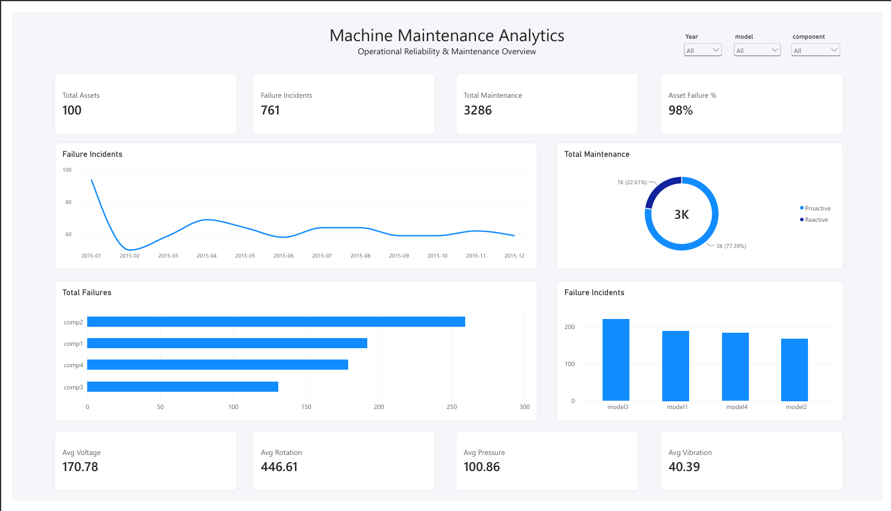
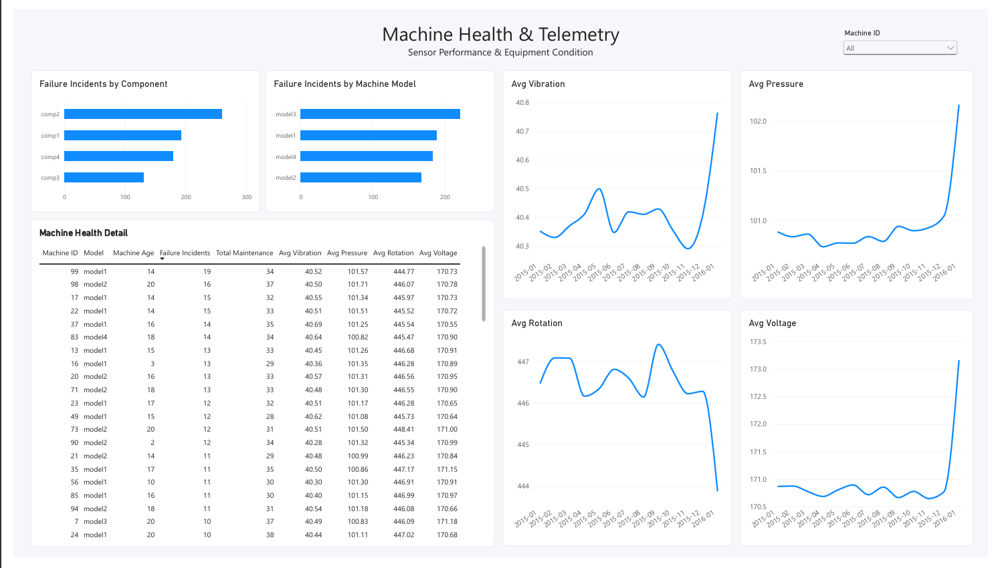
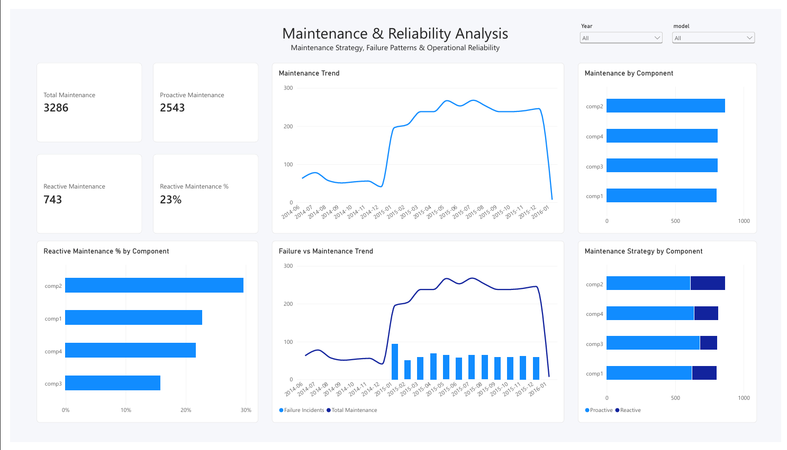

# Machine Maintenance & Reliability Analytics

Power BI analytics project exploring machine failures, maintenance strategies, equipment health, and telemetry patterns to support reliability analysis and maintenance decision-making.

## Project Overview

This project analyzes machine maintenance, failure, and telemetry data to explore equipment reliability and maintenance patterns. The analysis was developed in Power BI using a relational data model connecting machine, maintenance, failure, error, telemetry, date, and component data.

The dashboard provides three analytical views: an operational overview of machine failures and maintenance activities, machine-level health and telemetry analysis, and a deeper assessment of maintenance strategy and reliability patterns.

Beyond dashboard development, the project includes dimensional data modeling, DAX-based KPI development, exploratory analysis, correlation analysis, and data-quality validation to ensure that observed patterns are interpreted appropriately.

## Business Questions

This project was designed to answer the following analytical questions:

- Which machine components and models record the highest number of failure incidents?
- How are maintenance activities distributed between proactive and reactive maintenance?
- Which components show higher reliance on reactive maintenance?
- Is machine age associated with higher failure frequency?
- How do failure incidents and maintenance activities change over time?
- Which components should be prioritized for further reliability investigation?
- Are there data coverage or quality issues that could affect the interpretation of telemetry trends?

## Data Model

The Power BI data model was structured using dimension and fact-style tables to support consistent filtering and analysis across failures, maintenance, telemetry, and machine information.

### Dimension Tables
- **Machines** - machine identifier, model, and machine age.
- **DateTable** - calendar dimension containing date, month, quarter, year, and year-month attributes.
- **Components** - shared component dimension used to consistently filter both failure and maintenance records.

### Fact Tables
- **Telemetry** - time-series sensor readings including voltage, rotation, pressure, and vibration.
- **Failures** - recorded machine failure events by component.
- **Maintenance** - maintenance activities by machine, component, and maintenance type.
- **Errors** - recorded machine error events.

A dedicated **_Measures** table was also used to organize DAX measures separately from the source tables.

Relationships were configured primarily as one-to-many relationships from the dimension tables to the corresponding fact tables with single-direction filtering.

## Data Preparation

Data preparation and transformation were performed in Power Query and the Power BI data model before visualization.

Key preparation steps included:

- Reviewed the structure and data types of the machine, telemetry, failure, maintenance, and error datasets.
- Standardized date fields to support consistent time-based analysis across multiple tables.
- Created a dedicated **DateTable** containing year, quarter, month, and year-month attributes for time-series analysis.
- Created a shared **Components** dimension to provide consistent component-level filtering across the Failures and Maintenance tables.
- Established one-to-many relationships between dimension and fact tables using machine ID, date, and component keys.
- Created a dedicated **_Measures** table to organize calculated KPIs and analytical measures.
- Validated record coverage before interpreting time-series patterns, including identifying January 2016 as a partial telemetry period.

## DAX Measures

DAX measures were developed to calculate operational KPIs and support deeper reliability analysis.

Key measures include:

- **Total Assets** : number of machines included in the analysis.
- **Failure Incidents** : total recorded failure events.
- **Machines with Failure** : distinct machines with at least one recorded failure.
- **Asset Failure %** : percentage of machines that experienced at least one failure.
- **Total Maintenance** : total recorded maintenance activities.
- **Proactive Maintenance** : maintenance activities classified as proactive.
- **Reactive Maintenance** : maintenance activities classified as reactive.
- **Reactive Maintenance %** : proportion of maintenance activities classified as reactive.
- **Failure per Maintenance** : descriptive ratio of failure incidents to maintenance activities.
- **Age-Failure Correlation** : Pearson correlation between machine age and failure frequency.
- **Maintenance-Failure Correlation** : Pearson correlation between monthly maintenance activity and failure incidents.
- **Avg Voltage, Avg Rotation, Avg Pressure, Avg Vibration** : fleet-level average telemetry measures.
- **Telemetry Records** : record count used to validate telemetry data coverage.

## Dashboard

The dashboard consists of three analytical pages, each designed to address a different aspect of machine reliability and maintenance performance.

### 1. Overview

Provides a high-level view of asset reliability and maintenance activity, including total assets, failure incidents, maintenance volume, asset failure exposure, failure trends, component-level failures, machine model comparisons, and maintenance composition.

### 2. Machine Health & Telemetry

Focuses on machine-level condition and sensor behavior. The page combines failure information with voltage, rotation, pressure, and vibration telemetry, supported by a detailed machine-level table for further investigation.

### 3. Maintenance & Reliability

Analyzes maintenance strategy and reliability patterns, including proactive and reactive maintenance, component-level maintenance activity, reactive maintenance rates, and the relationship between maintenance activity and failure incidents.

